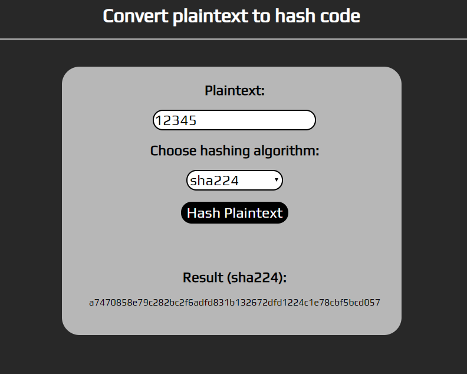

# convert-plaintext-to-hash-code
> You can select one of the hashing algorithms and generate a hashed version of your plaintext password.



## Requirements
```sh
A webserver with apache/nginx and php installed. Upload it and open localhost/index.php in a browser.
```

## Hashing Algorithms
- md2
- md4
- md5
- sha1
- sha224
- sha256
- sha512/224
- sha512/256
- sha512
- sha3-224
- sha3-256
- sha3-384
- sha3-512
- ripemd128
- ripemd160
- ripemd256
- ripemd320
- whirlpool
- tiger128,3
- tiger160,3
- tiger192,3
- tiger128,4
- tiger160,4
- tiger192,4
- snefru
- snefru256
- gost
- gost-crypto
- adler32
- crc32
- crc32b
- fnv132
- fnv1a32
- fnv164
- fnv1a64
- joaat
- haval128,3
- haval160,3
- haval192,3
- haval224,3
- haval256,3
- haval128,4
- haval160,4
- haval192,4
- haval224,4
- haval256,4
- haval128,5
- haval160,5
- haval192,5
- haval224,5
- haval256,5

## Contributing
1. Fork it (<https://github.com/Katsaros/convert-plaintext-to-hash-code/fork>)
2. Create your feature branch (`git checkout -b feature/fooBar`)
3. Commit your changes (`git commit -am 'Add some fooBar'`)
4. Push to the branch (`git push origin feature/fooBar`)
5. Create a new Pull Request
